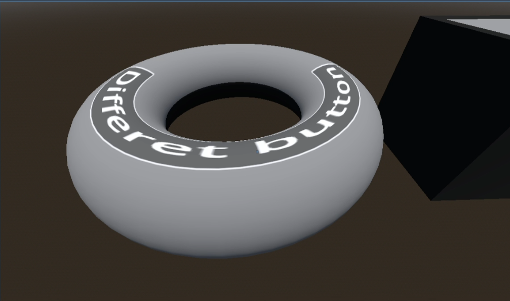

# Godot 4.4 3D UI toolkit
## Step by step:
1. download the repository

2. get the 3d_ui folder from this repo's addon folder and into your project's addon folder.

3. follow [this video](https://youtu.be/iwCkQwEMzq4) for setup instructions.

Feel free to let me know of any issues